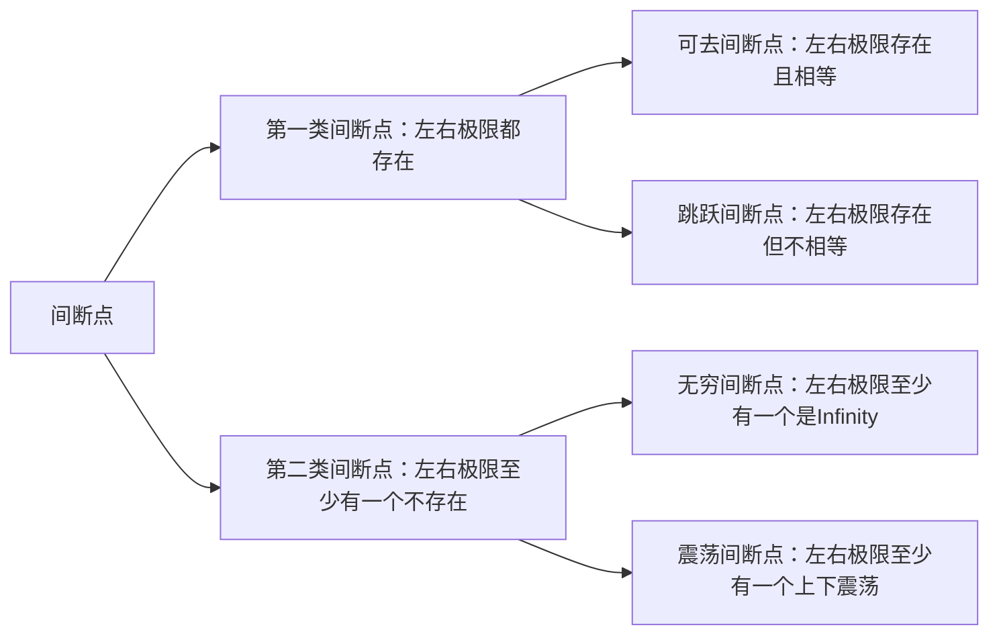

# 第三节 连续

::: details Tables of Content

[[toc]]

:::

## I. 函数的连续性

### 1.1 函数连续的定义

设函数$y = f(x)$在点$x_0$的某个邻域内有定义，极限$\lim_{x \to x_0} f(x)$存在，且$\lim_{x \to x_0} f(x) = f(x_0)$，则称函数$y = f(x)$在点$x_0$处连续，并称$x_0$是$f(x)$的连续点

::: tip Tip

即：若函数$f(x)$在某一点处的极限等于其在此点处的函数值，则称其在此点连续，简单的理解方式是，可以一笔画出来的函数一定是连续的

:::

### 1.2 左连续和右连续

如果函数满足条件$\lim_{x \to x_0^-} f(x) = f(x_0)$，则称函数$f(x)$在点$x_0$处左连续；

如果函数满足条件$\lim_{x \to x_0^+} f(x) = f(x_0)$，则称函数$f(x)$在点$x_0$处右连续

::: tip Tip

函数$f(x)$在点$x_0$处既左连续又右连续，即为其在点$x_0$处连续的充分必要条件

:::

- **例1**：若函数
    $$
    f(x) = 
    \begin{cases}
    \frac{1 - \cos \sqrt{x}}{ax}, & x \gt 0 \\
    b, & x \leq 0
    \end{cases}
    $$
    在$x = 0$处连续，则\_\_\_\_\_.

    - （A）$ab = \frac{1}{2}$
    - （B）$ab = -\frac{1}{2}$
    - （C）$ab = 0$
    - （D）$ab = 2$

    ::: details Answer

    既已知$f(x)$在$x = 0$处连续，则说明其同时满足左连续和右连续的条件：
    $$
    \lim_{x \to 0^-} f(x) = \lim_{x \to 0^+} f(x) = f(0) = b
    $$
    由此可得等式：
    $$
    \lim_{x \to 0^+} \frac{1 - \cos \sqrt{x}}{ax} = b
    $$
    两边同除以$b$可得：
    $$
    \lim_{x \to 0^+} \frac{1 - \cos \sqrt{x}}{abx} = 1
    $$
    由此可知：
    $$
    1 - \cos \sqrt{x} \sim \frac{1}{2} x \sim abx
    $$
    所以最终可得：
    $$
    ab = \frac{1}{2}
    $$
    :::

### 1.3 区间上的连续函数

若函数$f(x)$在开区间$(a, b)$内每一点连续，则称其在$(a, b)$内连续；若函数$f(x)$在$(a, b)$内连续，且在区间的左端点处右连续、右端点处左连续，则称其在闭区间$\left[ a, b \right]$上连续

- **例2**：设函数
    $$
    f(x) =
    \begin{cases}
    x^2 + 1, & |x| \leq c \\
    \frac{2}{|x|}, & |x| \gt c \\
    \end{cases}
    $$
    在$(-\infty, +\infty)$内连续，则$c$为何值？

    ::: details Answer

    为了使函数 $f(x)$ 在 $(-\infty, +\infty)$ 内连续，需要满足以下条件：

    1. 对于 $x = c$ 处的连续性：
        $$
        \lim_{x \to c^+} f(x) = \lim_{x \to c^-} f(x) = f(c) = c^2 + 1
        $$

    2. 对于 $x = -c$ 处的连续性：
        $$
        \lim_{x \to -c^+} f(x) = \lim_{x \to -c^-} f(x) = f(-c) = c^2 + 1
        $$

    由于函数 $f(x)$ 的形式是关于 $|x|$ 对称的，因此只需要检查 $x = c$ 处的连续性即可，由此可得等式：
    $$
    \lim_{x \to c^+} f(x) = \lim_{x \to c^+} \frac{2}{|x|} = \frac{2}{c} = f(c) = c^2 + 1
    $$
    最终可解得$c = 1$

    > 注意：此题目的条件中$|x| \leq c$隐含了$c \geq 0$，因此在极限$\lim_{x \to c^+} \frac{2}{|x|}$中可以直接去掉绝对值得到$\frac{2}{c}$
    
    :::

## II. 函数的间断点及其分类

### 2.1 间断点的定义

设函数$f(x)$在点$x_0$的某个邻域或者去心邻域内有定义，若$f(x)$在点$x_0$处具有以下三种情况之一，则称$x_0$为$f(x)$的间断点：

1. $f(x)$在点$x_0$处无定义
2. $f(x)$在点$x_0$处有定义，但$\lim_{x \to x_0} f(x)$不存在
3. $f(x)$在点$x_0$处有定义且$\lim_{x \to x_0} f(x)$存在，但$\lim_{x \to x_0} f(x) \neq f(x_0)$

### 2.2 间断点的分类

- **例3**：讨论函数$f(x) = \lim_{n \to \infty} \dfrac{1 - x^{2n}}{1 + x^{2n}} x \, (n \in \mathbb{N}_+)$的连续性，若有间断点，则判断其类型。

    ::: details Answer

    当$x = 0$时：
    $$
    f(x) = \lim_{n \to \infty}  \frac{1 - 0^{2n}}{1 + 0^{2n}} = 1
    $$
    当$|x| = 1$时：
    $$
    f(x) = \lim_{n \to \infty} \frac{1 - (\pm 1)^{2n}}{1 + (\pm 1)^{2n}} = 0
    $$
    当$0 \lt |x| \lt 1$时：
    $$
    f(x) = \lim_{n \to \infty} \frac{1 - x^{2n}}{1 + x^{2n}} = 1
    $$
    当$|x| \gt 1$时：
    $$
    f(x) = \lim_{n \to \infty} \frac{1 - x^{2n}}{1 + x^{2n}} = -1
    $$
    可见$x = 1$和$x = -1$这两个点是间断点，因为在$x = 1$的右侧和$x = -1$的左侧函数值为$-1$，而在$x = 1$的左侧和$x = -1$的右侧函数值为$1$，所以这两个点为跳跃间断点，左右极限值存在但不相等

    :::

- **例4**：函数$f(x) = \dfrac{e^{\frac{1}{x - 1}} \ln (1 + x)}{(e^x - 1)(x - 2)}$的第二类间断点的个数为\_\_\_\_\_.

    - （A）1
    - （B）2
    - （C）3
    - （D）4

    ::: details Answer

    寻找其未定义的点

    1. 当$x = 0$时：
        $$
        \lim_{x \to 0} \frac{e^{\frac{1}{x - 1}} \ln (1 + x)}{(e^x - 1)(x - 2)} = \frac{1}{-2e}
        $$
        
    2. 当$x = 2$时：
        $$
        \lim_{x \to 2} \frac{e^{\frac{1}{x - 1}} \ln (1 + x)}{(e^x - 1)(x - 2)} = \infty
        $$
    
    3. 当$x = 1$时：
        $$
        \lim_{x \to 1^+} \frac{e^{\frac{1}{x - 1}} \ln (1 + x)}{(e^x - 1)(x - 2)} = \infty
        $$
    
    4. 当$x = -1$时：
        $$
        \lim_{x \to -1^+} \frac{e^{\frac{1}{x - 1}} \ln (1 + x)}{(e^x - 1)(x - 2)} = \infty
        $$
    
    所以$x = 0$为一类间断点，$x = -1, 1, 2$为二类间断点，故而选C
    
    :::

## III. 连续函数的运算

1. 设函数$f(x)$和$g(x)$在点$x_0$处连续，则$f(x) \pm g(x)$、$f(x) \cdot g(x)$、$f(x) / g(x) \, (g(x_0) \neq 0)$都在点$x_0$连续
2. 连续函数的反函数也是连续函数
3. 连续函数的复合函数也是连续函数（但是两个具有间断点的函数组合而成的复合函数也有可能是连续的，因此复合函数连续未必能推出组成它的函数也连续）
4. 基本初等函数在其定义域上均连续
5. 一切初等函数在其定义区间内都连续（但在定义域上未必连续）

- **例5**：设$f(x)$和$\varphi(x)$在$(-\infty, +\infty)$上有定义，$f(x)$为连续函数，且$f(x) \neq 0$，$\varphi(x)$有间断点，则\_\_\_\_\_.

    - （A）$\varphi \left[ f(x) \right]$必有间断点
    - （B）$\left[ \varphi(x) \right]^2$必有间断点
    - （C）$f\left[ \varphi(x) \right]$必有间断点
    - （D）$\varphi(x) / f(x)$必有间断点

    ::: details Answer

    选项A、B、C的反例：
    $$
    f(x) \equiv 1 ,\, \varphi(x) =
    \begin{cases}
    -1, & x \lt 0 \\
    1, & x \geq 0
    \end{cases} ,\,
    \varphi\left[ f(x)) \right] \equiv 1
    $$
    故选D
    
    :::

## IV. 闭区间上连续函数的性质

1. **有界性定义**：设$f(x)$在闭区间$\left[ a, b \right]$上连续，则$f(x)$在$\left[ a, b \right]$上必有界
2. **最值定理**：设$f(x)$在闭区间$\left[ a, b \right]$上连续，则$f(x)$在$\left[ a, b \right]$上必有最大值$M$和最小值$m$
3. **介值定理**：设$f(x)$在闭区间$\left[ a, b \right]$上连续，则对于任意$c \in \left[ m, M \right]$，至少存在一点$\xi \in \left[ a, b \right]$，使$f(\xi) = c$
4. **零点定理**：设$f(x)$在闭区间$\left[ a, b \right]$上连续，若$f(a) \cdot f(b) \lt 0$，则至少存在一点$\xi \in \left[ a, b \right]$，使$f(\xi) = 0$
5. **推论**：设$f(x)$在开区间$(a, b)$上连续，若$\lim_{x \to a^+} f(x) = A \gt 0$、$\lim_{x \to b^-} f(x) = B \lt 0$，则至少存在一点$\xi \in (a, b)$，使$f(\xi) = 0$

- **例6**：设函数$f(x)$在$\left[ 0, 1 \right]$上连续，且$f(1) \gt 0$，$\lim_{x \to 0^+} \dfrac{f(x)}{x} \lt 0$，试证明：方程$f(x) = 0$在区间$(0, 1)$内至少有一个实根。

    ::: details Answer

    首先分析$\lim_{x \to 0^+} f(x) / x \lt 0$这个过程：已知在此过程中$x \gt 0$，而结果却小于$0$，这说明在此过程中$f(x) \lt 0$，即：
    $$
    \lim_{x \to 0^+} f(x) \lt 0
    $$
    又因为函数$f(x)$在$x = 0$这一点上连续，所以：
    $$
    \lim_{x \to 0} f(x) = \lim_{x \to 0^+} f(x) = \lim_{x \to 0^-} f(x) = f(0) \lt 0
    $$
    由此我们可以得到：
    $$
    M = f(1) \gt 0 ,\, m = f(0) \lt 0
    $$
    则由介值定理可得对于$0 \in \left[ m, M \right]$，至少存在一点$\xi \in \left[ a, b \right]$，使$f(\xi) = 0$

    :::

- **例7**：设$f(x)$在$\left[ 0, 2a \right]$上连续，且$f(0) = f(2a)$，试证明：$f(x) = f(x + a)$在$\left[ 0, a \right]$内至少有一个根。

    ::: details Answer

    函数$f(x)$的连续区间为：
    $$
    0 \leq x \leq 2a
    $$
    则函数$f(x + a)$的连续区间为：
    $$
    -a \leq x \leq a
    $$
    设函数$F(x) = f(x) - f(x + a)$，则其必然在两个函数的连续区间的交集上连续，即：
    $$
    0 \leq x \leq a
    $$
    求得$F(0)$的值为：
    $$
    F(0) = f(0) - f(a) = f(2a) - f(a)
    $$
    求得$F(a)$的值为：
    $$
    F(a) = f(a) - f(2a)
    $$
    设$F(0) = A$，可见$F(a) = -A$，则$F(0) \cdot F(a) = -A^2 \leq 0$，则根据零点定理可证：至少存在一点$\xi \in \left[ 0, a \right]$，使得$F(x) = f(x) - f(x + a) = 0$

    :::

- **例8**：若函数$f(x)$在$\left[ a, b \right]$上连续，$a \lt x_1 \lt x_2 \lt x_3 \lt ... \lt x_n \lt b \, (n \geq 3)$，试证明：在$(a, b)$内至少存在一点$\xi$，使$f(\xi) = \dfrac{f(x_1) + f(x_2) + f(x_3) + ... + f(x_n)}{n}$.

    ::: details Answer

    因为函数$f(x)$在区间$\left[ a, b \right]$上连续，根据最值定理，则在此区间内必然存在最大值$M_f$和最小值$m_f$，使得：
    $$
    \forall x \in \left[ a, b \right] ,\, \exists \, m_f \leq f(x) \leq M_f
    $$
    设$M = \max \{ f(x_1), f(x_2), ..., f(x_n) \}$、$m = \min\{ f(x_1), f(x_2), ..., f(x_n) \}$，则有：
    $$
    nm_f \leq nm \leq f(x_1) + f(x_2) + \dots + f(x_n) \leq nM \leq nM_f
    $$
    再同时除以$n$可得：
    $$
    m_f \leq m \leq \frac{f(x_1) + f(x_2) + \dots + f(x_n)}{n} \leq M \leq M_f
    $$
    最终根据介值定理可得，对于$m_f \leq \dfrac{f(x_1) + f(x_2) + f(x_3) + ... + f(x_n)}{n} \leq M_f$，至少存在一点$\xi \in \left[ a, b \right]$，使得$f(\xi) = \dfrac{f(x_1) + f(x_2) + f(x_3) + ... + f(x_n)}{n}$

    :::
