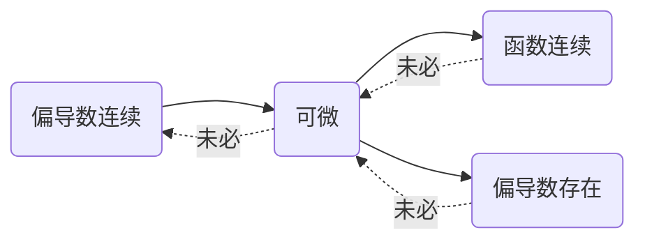

# 第二节 偏导数与全微分

## I. 偏导数

### 1.1 偏导数的定义

设函数$z = f(x, y)$在点$(x_0, y_0)$的某一邻域内有定义，当$y$固定在$y_0$，而$x$在$x_0$处有增量$\Delta x$时，相应的函数有增量：
$$
f(x_0 + \Delta x, y_0) - f(x_0, y_0)
$$
如果：
$$
\lim_{\Delta x \to 0} \frac{f(x_0 + \Delta x, y) - f(x_0, y_0)}{\Delta x}
$$
存在，则称此极限为函数$z = f(x, y)$在点$(x_0, y_0)$处对$x$的偏导数，记作：
$$
\left. \frac{\partial z}{\partial x} \right|_{(x_0, y_0)},
\left. \frac{\partial f}{\partial x} \right|_{(x_0, y_0)},
z'_x|_{(x_0, y_0)} \, \text{或} \, f'_x(x_0, y_0).
$$
类似地，函数$z = f(x, y)$在点$(x_0, y_0)$处对$x$的偏导数定义为：
$$
\lim_{\Delta y \to 0} \frac{f(x_0, y_0 + \Delta y) - f(x_0, y_0)}{\Delta x}
$$
记作：
$$
\left. \frac{\partial z}{\partial y} \right|_{(x_0, y_0)}, 
\left. \frac{\partial f}{\partial y} \right|_{(x_0, y_0)}, 
\left. z'_y \right|_{(x_0, y_0)} \, \text{或} \, f'_y(x_0, y_0)
$$
::: tip Tip

1. 函数$f(x, y)$在点$(x_0, y_0)$处的偏导数存在 $\Leftrightarrow$ $f_x'(x_0, y_0)$和$f_y'(x_0, y_0)$均存在
2. $f_x'(x_0, y_0)$意味着函数$f(x, y)$在点$(x_0, y_0)$处相对于$x$轴方向的切线的斜率，$f_y'(x_0, y_0)$同理
3. 函数在一点处偏导数的求法：
    - 定义法：适用于分段函数、抽象函数
    - 代入法：若要求$f_x'(x_0, y_0)$，直接将$y = y_0$代入得到一元函数$f(x, y_0)$，再对其求导
    - 偏导函数法：将偏导函数求出来，再将点代入

:::

- **例1**：设函数$f(x, y) = e^{\pi y} + (x - 1) \arctan \sqrt{\dfrac{x}{y}}$，求$f_x'(1, 1)$与$f_y'(1, 1)$.

    ::: details Answer

    定义法：
    $$
    \begin{gather}
    f_x'(1, 1) = \lim_{\Delta x \to 0} \frac{f(1 + \Delta x, 1) - f(1, 1)}{\Delta x} \\
    = \lim_{\Delta x \to 0} \frac{(e^{\pi} + \Delta x \arctan \sqrt{1 + \Delta x}) - (e^{\pi} + 0 \cdot \arctan 1)}{\Delta x} \\
    = \lim_{\Delta x \to 0} \arctan \sqrt{1 + \Delta x} = \arctan 1 = \frac{\pi}{4} \\
    f_y'(1, 1) = \lim_{\Delta y \to 0} \frac{f(1, 1 + \Delta y) - f(1, 1)}{\Delta y} \\
    = \lim_{\Delta y \to 0} \frac{(e^{(1 + \Delta y) \pi} + 0 \cdot \arctan \sqrt{\dfrac{1}{1 + \Delta y}}) - (e^{\pi} + 0 \cdot \arctan 1)}{\Delta y} \\
    = \lim_{\Delta y \to 0} \frac{e^{(1 + \Delta y) \pi} - e^{\pi}}{\Delta y}
    = e^{\pi} \lim_{\Delta y \to 0} \frac{e^{\pi \Delta y} - 1}{\Delta y} \\
    = e^{\pi} \lim_{\Delta y \to 0} \frac{e^{\pi \Delta y} - 1}{\pi \Delta y} \cdot \frac{\pi \Delta y}{\Delta y} = \pi e^{\pi} \\
    \end{gather}
    $$
    代入法：
    $$
    \begin{gather}
    f_x'(1, 1) = \left. \frac{\mathrm{d} f(x, 1)}{\mathrm{d}x} \right|_{x = 1}
    = \left. (\arctan \sqrt{x} + \frac{x - 1}{x + 1} \cdot \frac{1}{2 \sqrt{x}}) \right|_{x = 1}
    = \frac{\pi}{4} \\
    f_y'(1, 1) = \left. \frac{\mathrm{d}}{\mathrm{d}y} f(1, y) \right|_{y = 1}
    = \left. (e^{\pi y} \cdot \pi) \right|_{y = 1} = \pi e^{\pi} \\
    \end{gather}
    $$
    :::

- **例2**：设$f(x, y) = xy + x^2 + y^3$，求$f_x'(0, 1)$、$f_x'(1, 0)$、$f_y'(0, 2)$、$f_y'(2, 0)$.

    ::: details Answer

    定义法：
    $$
    \begin{gather}
    f_x'(0, 1) = \lim_{\Delta x \to 0} \frac{f(\Delta x, 1) - f(0, 1)}{\Delta x} \\
    = \lim_{\Delta x \to 0} \frac{\Delta x + \Delta x^2 + 1 - 0 - 0 - 1}{\Delta x} \\
    = \lim_{\Delta x \to 0} (1 + \Delta x) = \boxed{1} \\
    f_x'(1, 0) = \lim_{\Delta x \to 0} \frac{f(1 + \Delta x, 0) - f(1, 0)}{\Delta x} \\
    = \lim_{\Delta x \to 0} \frac{0 + (1 + \Delta x)^2 + 0 - 0 - 1 - 0}{\Delta x} \\
    = \lim_{\Delta x \to 0} \frac{\Delta x^2 + 2 \Delta x}{\Delta x}
    = \lim_{\Delta x \to 0} (\Delta x + 2) = \boxed{2} \\
    f_y'(0, 2) = \lim_{\Delta y \to 0} \frac{f(0, 2 + \Delta y) - f(0, 2)}{\Delta y} \\
    = \lim_{\Delta y \to 0} \frac{0 + 0 + (2 + \Delta y)^3 - 0 - 0 - 8}{\Delta y} \\
    = \lim_{\Delta y \to 0} \frac{2 \Delta y^2 + 8 \Delta y + 4 \Delta y + \Delta y^3 + 4 \Delta y^2}{\Delta y} \\
    = \lim_{\Delta y \to 0} \frac{\Delta y^3 + 6 \Delta y^2 + 12 \Delta y}{\Delta y}
    = \boxed{12} \\
    f_y'(2, 0) = \lim_{\Delta y \to 0} \frac{f(2, \Delta y) - f(2, 0)}{\Delta y} \\
    = \lim_{\Delta y \to 0} \frac{2 \Delta y + 4 + \Delta y^3 - 0 - 4 - 0}{\Delta y} \\
    = \lim_{\Delta y \to 0} \frac{2 \Delta y + \Delta y^3}{\Delta y} = \boxed{2} \\
    \end{gather}
    $$
    偏导函数法：
    $$
    f_x'(x, y) = y + 2x
    \Rightarrow
    \begin{cases}
    f_x'(0, 1) = 1 + 0 = 1 \\
    f_x'(1, 0) = 0 + 2 = 2 \\
    \end{cases}
    $$

    $$
    f_y'(x, y) = x + 3y^2
    \Rightarrow
    \begin{cases}
    f_y'(0, 2) = 0 + 3 \cdot 2^2 = 12 \\
    f_y'(2, 0) = 2 + 0 = 2 \\
    \end{cases}
    $$

    :::

- **例3**：设$f(x, y) = \sqrt{x^2 + y^4}$，试判断$f(x, y)$在$(0, 0)$处是否连续、偏导数是否存在？

    ::: details Answer
    $$
    \begin{gather}
    \lim_{(x, y) \to (0, 0)} \sqrt{x^2 + y^4} = f(0, 0) = 0 \\
    \not \exists L, f_x'(0, 0) = \lim_{\Delta x \to 0} \frac{\sqrt{\Delta x^2} - 0}{\Delta x} = L \\
    f_y'(0, 0) = \lim_{\Delta y \to 0} \frac{\sqrt{\Delta y^4} - 0}{\Delta y} = 0 \\
    \end{gather}
    $$
    :::

- **例4**：设：
    $$
    f(x, y) =
    \begin{cases}
    \dfrac{xy}{x^2 + y^2}, & (x, y) \neq (0, 0) \\
    0, & (x, y) = (0, 0) \\
    \end{cases}
    $$
    试判断$f(x, y)$在点$(0, 0)$处是否连续、偏导数是否存在？
    ::: details Answer
    $$
    \begin{gather}
    f(0, 0) = 0, \not \exists L, \lim_{(x, y) \to (0, 0)} \frac{xy}{x^2 + y^2} = L\\
    f_x'(0, 0) = \lim_{\Delta x \to 0} \frac{f(\Delta x, 0) - f(0, 0)}{\Delta x} = \lim_{\Delta x \to 0} \frac{\frac{0}{\Delta x^2} - 0}{\Delta x} = 0 \\
    f_y'(0, 0) = \lim_{\Delta y \to 0} \frac{f(0, \Delta y) - f(0, 0)}{\Delta y} = \lim_{\Delta y \to 0} \frac{\frac{0}{\Delta y^2} - 0}{\Delta y} = 0 \\
    \end{gather}
    $$
    :::

::: tip Tip

多元函数中的存在性与连续性之间并无关系

:::

### 1.2 高阶偏导数

设函数$z = f(x, y)$在区域$D$内具有偏导数：
$$
\frac{\partial z}{\partial x} = f_x'(x, y),
\frac{\partial z}{\partial y} = f_y'(x, y)
$$
于是在$D$内$f_x'(x, y)$、$f_y'(x, y)$都是关于$x$、$y$的函数，如果这两个函数的偏导数也存在，那么便称其为函数$z = f(x, y)$的二阶偏导数，记作：
$$
\begin{gather}
\frac{\partial}{\partial x} (\frac{\partial z}{\partial x}) = \frac{\partial^2 z}{\partial x^2} = f_{xx}''(x, y),
\frac{\partial}{\partial y} (\frac{\partial z}{\partial x}) = \frac{\partial^2 z}{\partial x \partial y} = f_{xy}''(x, y) \\
\frac{\partial}{\partial x} (\frac{\partial z}{\partial y}) = \frac{\partial^2 z}{\partial y \partial x} = f_{yx}''(x, y),
\frac{\partial}{\partial y} (\frac{\partial z}{\partial y}) = \frac{\partial^2 z}{\partial y^2} = f_{yy}''(x, y) \\
\end{gather}
$$
其中$\dfrac{\partial^2 z}{\partial x \partial y}$和$\dfrac{\partial^2 z}{\partial y \partial x}$是$z = f(x, y)$的两个二阶混合偏导数、$\dfrac{\partial^2 z}{\partial x^2}$和$\dfrac{\partial^2 z}{\partial y^2}$是$z = f(x, y)$的两个二阶纯偏导数

::: tip Tip

**定理**：若$f_{xy}''(x, y)$与$f_{yx}''(x, y)$在$D$上连续，则$f_{xy}''(x, y) = f_{yx}''(x, y)$

:::

- **例5**：设$z = x^3 y^2 - 3x y^3 - xy + 1$，求$\dfrac{\partial^2 z}{\partial x^2}$、$\dfrac{\partial^2 z}{\partial y^2}$、$\dfrac{\partial^2 z}{\partial x \partial y}$、$\dfrac{\partial^2 z}{\partial y \partial x}$.

    ::: details Answer
    $$
    \begin{gather}
    \frac{\partial z}{\partial x} = 3 y^2 x^2 - 3 y^3 - y \\
    \frac{\partial z}{\partial y} = 2 x^3 y - 9 x y^2 - x \\
    \frac{\partial^2 z}{\partial x^2} = 6 y^2 x \\
    \frac{\partial^2 z}{\partial y^2} = 2x^3 - 18 x y \\
    \frac{\partial^2 z}{\partial x \partial y} = 6 x^2 y - 9 y^2 - 1 \\
    \frac{\partial^2 z}{\partial y \partial x} = 6 y x^2 - 9 y^2 - 1 \\
    \end{gather}
    $$
    :::
    
- **例6**：验证函数$z = \ln \sqrt{x^2 + y^2}$满足方程$\dfrac{\partial^2 z}{\partial x^2} + \dfrac{\partial^2 z}{\partial y^2} = 0$.

    ::: details Answer
    $$
    \begin{gather}
    \frac{\partial^2 z}{\partial x^2} 
    = \frac{\partial}{\partial x} (\frac{\partial z}{\partial x})
    = \frac{\partial}{\partial x} \left[ (x^2 + y^2)^{-\frac{1}{2}} \cdot \frac{1}{2} (x^2 + y^2)^{-\frac{1}{2}} \cdot 2x \right] \\
    = \frac{\partial}{\partial x} \left[ x (x^2 + y^2)^{-1} \right]
    = (x^2 + y^2)^{-1} - 2x^2 (x^2 + y^2)^{-2} \\
    \frac{\partial^2 z}{\partial y^2} 
    = \frac{\partial}{\partial y} (\frac{\partial z}{\partial x})
    = \frac{\partial}{\partial y} \left[ (x^2 + y^2)^{-\frac{1}{2}} \cdot \frac{1}{2} (x^2 + y^2)^{-\frac{1}{2}} \cdot 2y \right] \\
    = \frac{\partial}{\partial x} \left[ y (x^2 + y^2)^{-1} \right]
    = (x^2 + y^2)^{-1} - 2y^2 (x^2 + y^2)^{-2} \\
    \Rightarrow \frac{\partial^2 z}{\partial x^2} + \frac{\partial^2 z}{\partial y^2}
    = 2 (x^2 + y^2)^{-1} - 2 (x^2 + y^2) (x^2 + y^2)^{-2} \\
    = 2 (x^2 + y^2)^{-1} - 2 (x^2 + y^2)^{-1} = 0 \\
    \end{gather}
    $$
    :::

## II. 全微分

### 2.1 全微分的定义

设$z = f(x, y)$在$U(x_0, y_0)$上有定义，且$(x_0 + \Delta x, y_0 + \Delta y) \in U(x_0, y_0)$，若：
$$
\Delta z = f(x_0 + \Delta x, y_0 + \Delta y) - f(x_0, y_0) = A \Delta x + B \Delta y + \omicron(\rho),
\rho = \sqrt{(\Delta x)^2 + (\Delta y)^2}
$$
则称$f(x, y)$在点$(x_0, y_0)$处可微，且线性主部$A \Delta x + B \Delta y$称为$f(x, y)$在点$(x_0, y_0)$处的全微分，记作：
$$
\left. \mathrm{d} z \right|_{(x_0, y_0)} = A \Delta x + B \Delta y
$$

### 2.2 可微的条件

#### 2.2.1 可微的必要条件

1. 若$f(x, y)$在点$(x_0, y_0)$处可微，则它必然也在点$(x_0, y_0)$处连续

    ::: details Proof

    因为$f(x, y)$在点$(x_0, y_0)$处可微，所以：
    $$
    \Delta z = A \Delta x + B \Delta y + \omicron(\rho), \rho = \sqrt{(\Delta x)^2 + (\Delta y)^2}
    $$
    对两边同时取极限可得：
    $$
    \lim_{(\Delta x, \Delta y) \to (0, 0)} \Delta z 
    = \lim_{(\Delta x, \Delta y) \to (0, 0)} \left[ A \Delta x + B \Delta y + \omicron(\rho) \right]
    = 0
    $$
    然后进行换元：
    $$
    \lim_{(\Delta x, \Delta y) \to (0, 0)} \Delta z = \lim_{(x, y) \to (x_0, y_0)} f(x, y) - f(x_0, y_0) = 0
    $$
    所以最终可得：
    $$
    \lim_{(x, y) \to (x_0, y_0)} f(x, y) = f(x_0, y_0)
    $$
    :::

2. 若$f(x, y)$在点$(x_0, y_0)$处可微，则$A = f_x'(x_0, y_0)$、$B = f_y'(x_0, y_0)$

    ::: details Proof

    因为$f(x, y)$在点$(x_0, y_0)$处可微，所以：
    $$
    \Delta z = A \Delta x + B \Delta y + \omicron(\rho), \rho = \sqrt{(\Delta x)^2 + (\Delta y)^2}
    $$
    当$\Delta y = 0$时可得：
    $$
    \Delta z = f(x_0 + \Delta x, y_0) - f(x_0, y_0) = A \Delta x + \omicron(\left| \Delta x \right|)
    $$
    同时除以$\Delta x$并取极限可得：
    $$
    \lim_{\Delta x \to 0} \frac{f(x_0 + \Delta x, y_0) - f(x_0, y_0)}{\Delta x} 
    = \lim_{\Delta x \to 0} \frac{A \Delta x + \omicron(\left| \Delta x \right|)}{\Delta x} = A
    $$
    于是同理可得：
    $$
    A = f_x'(x_0, y_0), B = f_y'(x_0, y_0)
    $$
    :::

::: tip Tip

1. 若$f(x, y)$可微，则$\mathrm{d}z = f_x'(x, y) \mathrm{d}x + f_y'(x, y) \mathrm{d}y$
2. 若$f_x'$与$f_y'$均存在，则$f_x' \mathrm{d}x + f_y' \mathrm{d}y$未必是函数的全微分

:::

#### 2.2.2 可微的充分条件

若$f_x'(x, y)$、$f_y'(x, y)$在点$(x_0, y_0)$处连续，则$f(x, y)$在点$(x_0, y_0)$处可微

#### 2.2.3 可微的充要条件

$$
\begin{gather}
f(x, y) \text{在点} (x_0,y_0) \text{处可微} \\
\Leftrightarrow \Delta z = f_x'(x_0, y_0) \Delta x + f_y'(x_0, y_0) \Delta y + \omicron(\rho) \\
\Leftrightarrow \Delta z - f_x'(x_0, y_0) \Delta x - f_y'(x_0, y_0) \Delta y = \omicron(\rho) \\
\Leftrightarrow \lim_{\rho \to 0} \frac{\Delta z - f_x'(x_0, y_0) \Delta x - f_y'(x_0, y_0) \Delta y}{\rho}
= \lim_{\rho \to 0} \frac{\omicron(\rho)}{\rho} = 0 \\
\Leftrightarrow \lim_{(\Delta x, \Delta y) \to (0, 0)} \frac{\Delta z - f_x'(x_0, y_0) \Delta x - f_y'(x_0, y_0) \Delta y}{\sqrt{(\Delta x)^2 + (\Delta y)^2}} = 0 \\
\end{gather}
$$

::: tip Tip

使用场景：特殊函数在特殊点处可微性的判定

:::

### 2.3 多元函数连续、偏导存在、可微之间的关系

- **例7**：设函数：
    $$
    f(x, y) =
    \begin{cases}
    \dfrac{xy}{\sqrt{x^2 + y^2}}, & x^2 + y^2 \neq 0 \\
    0, & x^2 + y^2 = 0 \\
    \end{cases}
    $$
    则在点$(0, 0)$处函数$f(x, y)$满足：

    - A：不连续
    - B：连续但偏导数不存在
    - C：连续且偏导数存在但不可微
    - D：可微

    ::: details Answer

    - 连续性的判定：

        因为存在以下不等式：
        $$
        \begin{gather}
        -\frac{x^2 + y^2}{2} \leq |xy| \leq \frac{x^2 + y^2}{2} \\
        \Rightarrow -\frac{x^2 + y^2}{2 \sqrt{x^2 + y^2}} \leq \left| \frac{xy}{\sqrt{x^2 + y^2}} \right| \leq \frac{x^2 + y^2}{2 \sqrt{x^2 + y^2}} \\
        \Rightarrow -\frac{\sqrt{x^2 + y^2}}{2} \leq \left| \frac{xy}{\sqrt{x^2 + y^2}} \right| \leq \frac{\sqrt{x^2 + y^2}}{2} \\
        \end{gather}
        $$
        所以：
        $$
        \begin{gather}
        \lim_{(x, y) \to (0, 0)} -\frac{\sqrt{x^2 + y^2}}{2} = \lim_{(x, y) \to (0, 0)} \frac{\sqrt{x^2 + y^2}}{2} = 0 \\
        \Rightarrow \lim_{(x, y) \to (0, 0)} \left| \frac{xy}{\sqrt{x^2 + y^2}} \right| = 0 \\
        \end{gather}
        $$
        又因为：
        $$
        -|xy| \leq xy \leq |xy| 
        \Rightarrow -\left| \frac{xy}{\sqrt{x^2 + y^2}} \right| \leq \frac{xy}{\sqrt{x^2 + y^2}} \leq \left| \frac{xy}{\sqrt{x^2 + y^2}} \right|
        $$
        所以最终可得：
        $$
        \begin{gather}
        \lim_{(x, y) \to (0, 0)} \left| \frac{xy}{\sqrt{x^2 + y^2}} \right| = \lim_{(x, y) \to (0, 0)} -\left| \frac{xy}{\sqrt{x^2 + y^2}} \right| = 0 \\
        \Rightarrow \lim_{(x, y) \to (0, 0)} \frac{xy}{\sqrt{x^2 + y^2}} = f(0, 0) = 0 \\
        \end{gather}
        $$
        
    - 偏导数存在性的判定：
        $$
        \begin{gather}
        f_x'(0, 0) = \lim_{\Delta x \to 0} \frac{f(0 + \Delta x, 0) - f(0, 0)}{\Delta x} = 0 \\
        f_y'(0, 0) = \lim_{\Delta y \to 0} \frac{f(0, 0 + \Delta y) - f(0, 0)}{\Delta y} = 0 \\
        \end{gather}
        $$
        因此，两个偏导数皆存在
    
    - 可微性的判定：
    
        使用可微的充要条件：
        $$
        \begin{gather}
        \not \exists L, \lim_{(\Delta x, \Delta y) \to (0, 0)} \frac{\Delta z - f_x'(0, 0) \Delta x - f_y'(0, 0) \Delta y}{\sqrt{(\Delta x)^2 + (\Delta y)^2}} \\
        = \lim_{(\Delta x, \Delta y) \to (0, 0)} \frac{f(\Delta x, \Delta y)}{\sqrt{(\Delta x)^2 + (\Delta y)^2}} \\
        = \lim_{(\Delta x, \Delta y) \to (0, 0)} \frac{xy}{(\Delta x)^2 + (\Delta y)^2} = L \\
        \end{gather}
        $$
        显然并不可微
    
    所以最终选C
    
    :::
    
- **例8**：设函数：
    $$
    f(x, y) =
    \begin{cases}
    (x^2 + y^2) \sin \dfrac{1}{\sqrt{x^2 + y^2}}, & (x, y) \neq (0, 0) \\
    0, & (x, y) = (0, 0) \\
    \end{cases}
    $$
    讨论$f(x, y)$在点$(0, 0)$处的可微性

    ::: details Answer

    首先求出两个偏导数的值：
    $$
    \begin{gather}
    f_x'(0, 0) = \lim_{\Delta x \to 0} \frac{f(\Delta x, 0) - f(0, 0)}{\Delta x} \\
    = \lim_{\Delta x \to 0} \frac{(\Delta x)^2 \sin \dfrac{1}{|x|}}{\Delta x} = 0 \\
    f_y'(0, 0) = \lim_{\Delta y \to 0} \frac{f(0, \Delta y) - f(0, 0)}{\Delta y} \\
    = \lim_{\Delta y \to 0} \frac{(\Delta y)^2 \sin \dfrac{1}{|\Delta y|}}{\Delta y} = 0 \\
    \end{gather}
    $$
    然后考虑可微的充要条件：
    $$
    \lim_{(\Delta x, \Delta y) \to (0, 0)} \frac{\Delta z - f_x'(0, 0) \Delta x - f_y'(0, 0) \Delta y}{\sqrt{(\Delta x)^2 + (\Delta y)^2}} \\
    = \lim_{(\Delta x, \Delta y) \to (0, 0)} \frac{f(\Delta x, \Delta y) - f(0, 0)}{\sqrt{(\Delta x)^2 + (\Delta y)^2}} \\
    = \lim_{(\Delta x, \Delta y) \to (0, 0)} \frac{\left[ (\Delta x)^2 + (\Delta y)^2 \right] \sin \dfrac{1}{\sqrt{(\Delta x)^2 + (\Delta y)^2}}}{\sqrt{(\Delta x)^2 + (\Delta y)^2}} \\
    = \lim_{(\Delta x, \Delta y) \to (0, 0)} \sqrt{(\Delta x)^2 + (\Delta y)^2} \sin \dfrac{1}{\sqrt{(\Delta x)^2 + (\Delta y)^2}} \\
    $$
    对于这个极限，考虑以下不等式：
    $$
    r = \sqrt{(\Delta x)^2 + (\Delta y)^2}, -1 \leq \sin \frac{1}{r} \leq r \Rightarrow -r \leq r \sin \frac{1}{r} \leq r
    $$
    又因为：
    $$
    \lim_{(\Delta x, \Delta y) \to (0, 0)} -r = \lim_{(\Delta x, \Delta y) \to (0, 0)} r = 0
    $$
    所以根据夹逼准则可得：
    $$
    \lim_{(\Delta x, \Delta y) \to (0, 0)} r \sin \frac{1}{r} = 0
    $$
    因此$f(x, y)$在点$(0, 0)$处可微
    
    :::
    
- **例10**：已知二元函数$f(x, y)$一阶偏导数连续，若函数$z = f(x, y)$满足$\dfrac{\partial^2 z}{\partial x \partial y} = x + y$，且$f(x, 0) = x$、$f(0, y) = y^2$，求$f(x, y)$.

    ::: details Answer
    $$
    f_x'(x, y) = \int f_{xy}''(x, y) \mathrm{d}y = xy + \frac{1}{2} y^2 + C(x), S'(x) = C(x) \\
    f(x, y) = \int f_x'(x, y) \mathrm{d}x = \frac{1}{2} x^2 y + \frac{1}{2} xy^2 + S(x) + D(y) \\
    f(x, 0) = S(x) + D(0) = x \Rightarrow S(x) = x - D(0) \\
    f(0, y) = S(0) + D(y) = y^2 \Rightarrow D(y) = y^2 - S(0) \\
    f(0, 0) = S(0) + D(0) = 0 \Rightarrow -S(0) - D(0) = 0 \\
    \Rightarrow f(x, y) = \frac{1}{2} x^2 y + \frac{1}{2} x y^2 + x + y^2 \\
    $$
    :::
